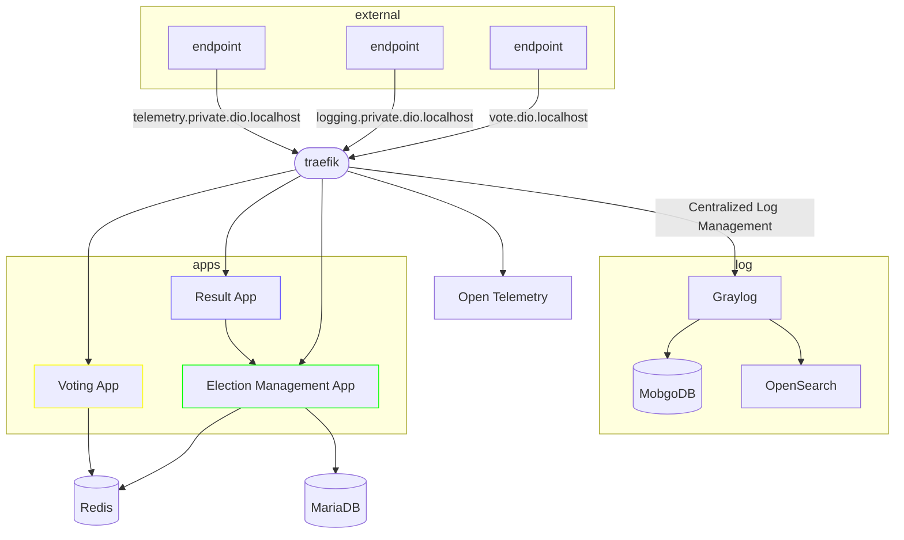
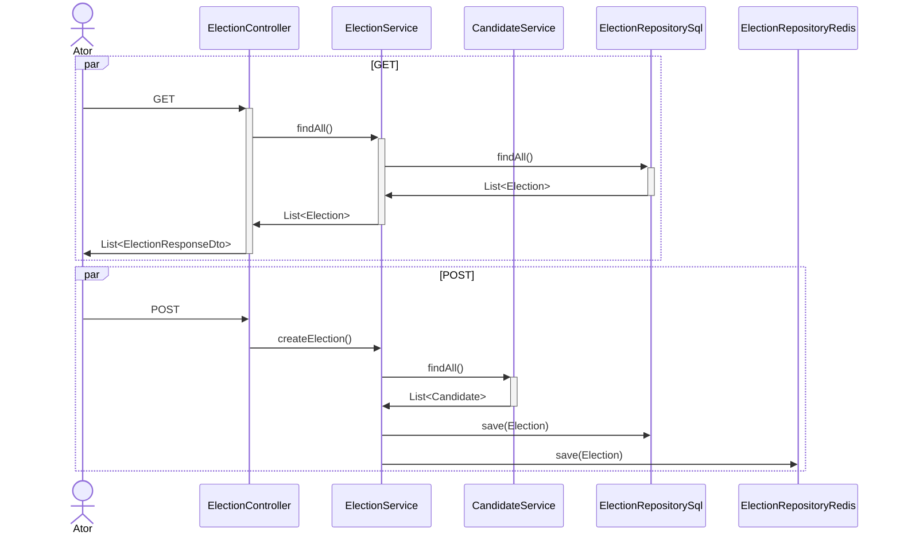
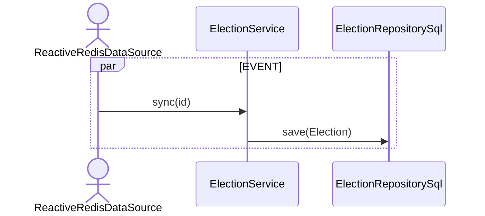
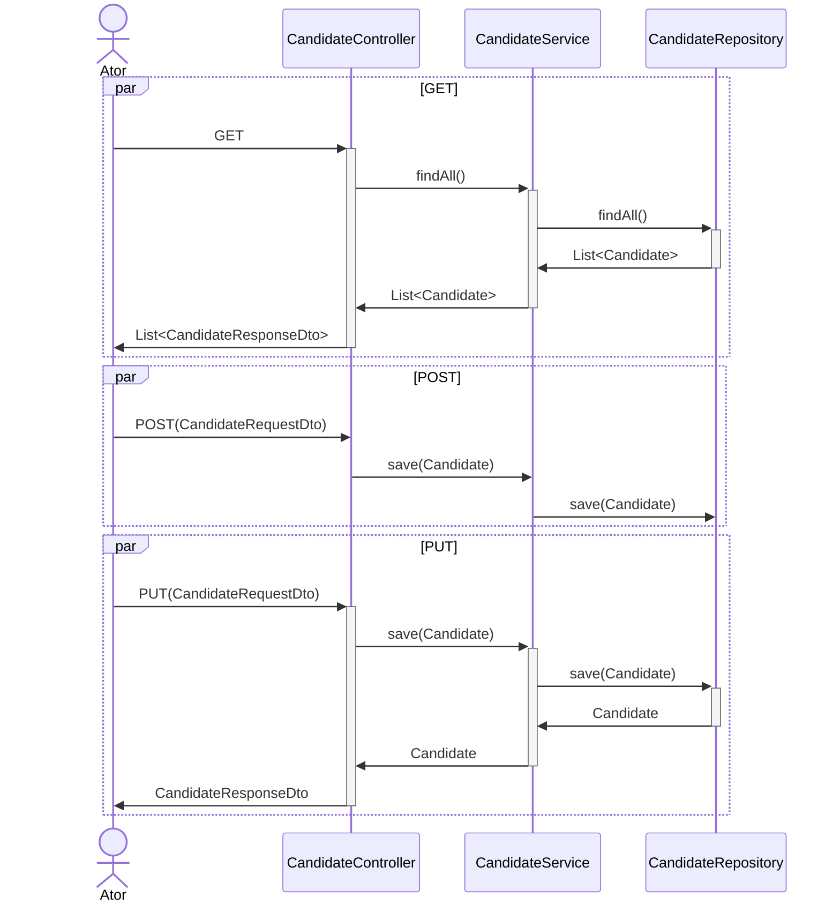

# :question: Sobre

Esse projeto é um exercício da aula da **DIO "Desenvolvendo um Sistema para Eleçãao Usando Quarkus-Framework"** onde o código fonte do projeto original se encontra neste [link]([https://github.com/digitalinnovationone/lab-padroes-projeto-spring](https://github.com/thpoiani/lab-quarkus)).

O projeto original foi feito em março de 2023, com Quarkus 2.16.4.Final e JDK 17. Farei utilizando a mesma ideia do projeto, porém atualizando para o Quarkus 3.8 LTS e Java21, além de realizar algumas modificações na arquitetura.

## Escopo

* Candidatos são listados, cadastrados e editados
* Todos os candidatos registrados participam de uma eleição, quando for iniciada
* Candidatos recebem votos de eleitores
* Resultado disponível em tempo real

**Requisitos não funcionais**: confiabilidade, disponibilidade, interoperabilidade, escalabilidade

# Arquitetura

## Quarkus
Quarkus é um **framework** de código aberto para **desenvolvimento de aplicativos Java** criado com foco em eficiência de recursos e tempos de inicialização ultrarrápidos. Ele foi projetado para ajudar os desenvolvedores a criar aplicativos Java de alta performance e escaláveis, especialmente para a nuvem.

O Quarkus utiliza tecnologias modernas, como a plataforma **GraalVM** e o Kubernetes, para criar aplicativos Java altamente otimizados que consomem menos recursos e têm tempos de inicialização muito rápidos. Ele é construído em cima do Java Standard Edition (SE) e suporta vários frameworks, como o Eclipse MicroProfile e o Spring.

Com o Quarkus, os desenvolvedores podem criar aplicativos Java com recursos avançados, como suporte a serviços web RESTful, reatividade, segurança, monitoramento de métricas e muito mais. Ele oferece um conjunto completo de ferramentas para desenvolvimento, teste e implantação de aplicativos, incluindo suporte para ambientes de contêiner e nuvem.

O Quarkus é uma solução ideal para desenvolvedores que buscam construir aplicativos Java modernos, rápidos e escaláveis para ambientes de nuvem. Ele é mantido pela Red Hat e está disponível como software livre e de código aberto sob a licença Apache 2.0.

## Traefik
Traefik é um software de roteamento de tráfego e balanceamento de carga projetado para ser usado em ambientes de contêineres, como o Docker. Ele atua como um proxy reverso que pode rotear solicitações HTTP e TCP para diferentes serviços em seu cluster de contêineres, garantindo que o tráfego chegue ao serviço correto com base em regras de roteamento configuráveis.

Traefik é projetado para ser fácil de configurar e pode detectar automaticamente novos serviços conforme eles são adicionados ou removidos do seu ambiente de contêineres. Ele também suporta integrações com vários provedores de orquestração de contêineres, como o **Kubernetes**, o Docker Swarm e o Mesos.

Entre seus recursos, o Traefik suporta balanceamento de carga, SSL/TLS com renovação automática, autenticação e autorização, gerenciamento de tráfego em várias regiões geográficas e muito mais. Graças a esses recursos, o Traefik é uma escolha popular para empresas que executam aplicativos em ambientes de contêineres e precisam garantir que o tráfego seja distribuído de forma eficiente e segura.

## MariaDB
MariaDB é um sistema de gerenciamento de banco de dados relacional (RDBMS) que foi criado a partir do código-fonte do MySQL, após sua aquisição pela Oracle Corporation em 2009. O nome "MariaDB" vem do nome da filha mais nova do fundador do MySQL, Michael Widenius.

O MariaDB é compatível com a API do MySQL e oferece recursos adicionais, como suporte para vários motores de armazenamento, incluindo o XtraDB, que é uma versão aprimorada do InnoDB, e o Aria, que é um motor de armazenamento transacional de alto desempenho.

O MariaDB é distribuído como software livre e de código aberto, sob os termos da licença GPL. Ele é amplamente utilizado por empresas e organizações em todo o mundo, incluindo grandes empresas como Google, Wikipedia, Red Hat e IBM.

Entre seus recursos, o MariaDB oferece suporte para transações ACID, replicação de banco de dados em tempo real, particionamento de tabela, clustering de banco de dados e muitos outros recursos que tornam o gerenciamento de bancos de dados em escala muito mais fácil e eficiente. Além disso, o MariaDB é altamente escalável e pode ser facilmente implantado em ambientes de nuvem, contêineres e ambientes de alta disponibilidade.

## Redis
Redis é um **sistema de armazenamento de chave-valor em memória** de código aberto que é amplamente usado como **banco de dados**, **cache** e **broker de mensagens**. Ele é projetado para ser extremamente rápido e escalável, oferecendo tempos de resposta de leitura/gravação em memória muito baixos.

Redis é um banco de dados NoSQL que armazena dados na memória, permitindo que ele seja muito rápido e eficiente para operações de leitura e gravação. Além disso, o Redis possui recursos avançados de armazenamento em cache, como a expiração de chaves, o armazenamento de dados em disco e o suporte para operações de lista, conjunto, hash e ordenação.

O Redis é amplamente utilizado em aplicações que exigem alta velocidade de processamento de dados, como mídias sociais, jogos, análise de dados, e-commerce e muito mais. Além disso, ele também é usado como cache em aplicativos da web para reduzir a carga em bancos de dados e melhorar o desempenho de consultas.

O Redis **ERA** distribuído como software livre e de código aberto ([até março/2024]([https://redis.io/blog/redis-adopts-dual-source-available-licensing/])), agora temos opções como: [Valkey]([[https://github.com/valkey-io/valkey](https://github.com/valkey-io/valkey)]), [Garnet]([[https://github.com/microsoft/garnet](https://github.com/microsoft/garnet)]), [KeyDB]([https://github.com/Snapchat/KeyDB]), [DragonFly]([[https://www.dragonflydb.io](https://www.dragonflydb.io/)]), etc.

## Graylog
Graylog é uma **plataforma de gerenciamento de logs e análise de dados em tempo real** de código aberto que ajuda as empresas a coletar, armazenar, pesquisar e analisar dados de log de várias fontes em um único local. Ele oferece uma interface de usuário baseada na web que permite visualizar e analisar dados de log em tempo real, o que ajuda a solucionar problemas e identificar tendências rapidamente.

O Graylog é altamente escalável e pode ser facilmente integrado com várias fontes de dados, incluindo syslog, **GELF**, JSON, CEF e muitos outros. Ele também suporta a análise de dados não estruturados, como logs de aplicativos, eventos de rede e mensagens de IoT. O Graylog permite que os usuários definam alertas para eventos importantes, criem painéis personalizados e visualizem dados em gráficos e tabelas.

Além disso, o Graylog oferece recursos avançados, como indexação de dados em tempo real, busca rápida, clusterização e suporte a plugins personalizados. Ele pode ser implantado em nuvens públicas, privadas ou híbridas, bem como em contêineres e ambientes de alta disponibilidade.

O Graylog é amplamente utilizado por empresas em todo o mundo, incluindo grandes organizações como IBM, SAP e SoundCloud. Ele é distribuído como software livre e de código aberto, sob os termos da licença GNU General Public License v3.

## OpenSearch
OpenSearch é uma plataforma de busca e análise de dados em tempo real de código aberto, baseada no projeto Elasticsearch, que permite aos usuários pesquisar e analisar grandes quantidades de dados estruturados e não estruturados. É uma alternativa totalmente compatível e gratuita do Elasticsearch, criada por um grupo de empresas liderado pela AWS.

OpenSearch oferece recursos avançados de busca e análise de dados em tempo real, como pesquisa de texto completo, pesquisa geoespacial, análise de dados em tempo real, análise de séries temporais e pesquisa de agregação. Ele é projetado para lidar com grandes volumes de dados e escalabilidade horizontal, permitindo que os usuários adicionem e dimensionem nodes conforme necessário.

O OpenSearch é compatível com vários clientes e bibliotecas, incluindo o Kibana, Logstash e Beats. Ele pode ser usado para uma ampla gama de casos de uso, como pesquisa e análise de registros de aplicativos, análise de segurança, análise de rede e muito mais.

O OpenSearch é distribuído como software livre e de código aberto sob os termos da licença Apache 2.0. Ele pode ser executado em várias plataformas, incluindo Linux, macOS e Windows, além de ser suportado por várias ferramentas de gerenciamento de contêineres, como o Docker e Kubernetes.

## MongoDB
MongoDB é um **banco de dados NoSQL** (não relacional) de código aberto, **orientado a documentos**, projetado para lidar com grandes volumes de dados, fornecendo alta escalabilidade e desempenho. Ele é uma alternativa aos bancos de dados relacionais tradicionais, como MySQL, PostgreSQL e Oracle.

No MongoDB, os dados são armazenados em documentos no formato JSON (JavaScript Object Notation) e, ao contrário dos bancos de dados relacionais, o MongoDB não requer um esquema definido previamente para armazenar dados. Isso permite uma grande flexibilidade para modelar dados complexos, pois cada documento pode ter sua própria estrutura e campos variáveis.

O MongoDB suporta várias operações de consulta e análise de dados, incluindo consultas ad-hoc, agregação de dados, indexação e pesquisa geoespacial. Ele também oferece recursos avançados, como replicação automática, sharding e balanceamento de carga para escalabilidade horizontal, e suporta várias linguagens de programação, incluindo Python, Java, Ruby e muitas outras.

O MongoDB é amplamente utilizado em aplicativos da web, aplicativos móveis, jogos, mídias sociais e muitas outras áreas em que é necessária a capacidade de processar grandes volumes de dados de forma rápida e escalável. Ele é distribuído como software livre e de código aberto sob os termos da licença Server Side Public License (SSPL).

## Jaeger Tracing
Jaeger Tracing é uma **plataforma de rastreamento** de distribuição de código aberto que ajuda a monitorar e depurar aplicativos distribuídos e microserviços. Ele fornece visibilidade sobre como as solicitações são processadas em diferentes serviços e em diferentes camadas de um aplicativo, permitindo que os desenvolvedores identifiquem gargalos de desempenho e otimizem a carga de trabalho do aplicativo.

O Jaeger foi desenvolvido originalmente pelo Uber e agora é um projeto de código aberto da Cloud Native Computing Foundation (CNCF), o que significa que é amplamente adotado pela comunidade de desenvolvedores de software.

O Jaeger suporta vários protocolos, incluindo o OpenTracing, que é um padrão de rastreamento distribuído, e pode ser integrado com várias bibliotecas de código aberto e linguagens de programação. Ele oferece recursos como a geração de rastreamentos de solicitações, a coleta de métricas de desempenho e a visualização de dados em um painel interativo baseado na web.

Ao fornecer informações detalhadas sobre o fluxo de solicitações em um aplicativo distribuído, o Jaeger permite que os desenvolvedores identifiquem rapidamente problemas de desempenho e depurem problemas em um ambiente de produção. Isso ajuda a melhorar a experiência do usuário e reduzir o tempo de inatividade do aplicativo.

## Projeto Election-Management

